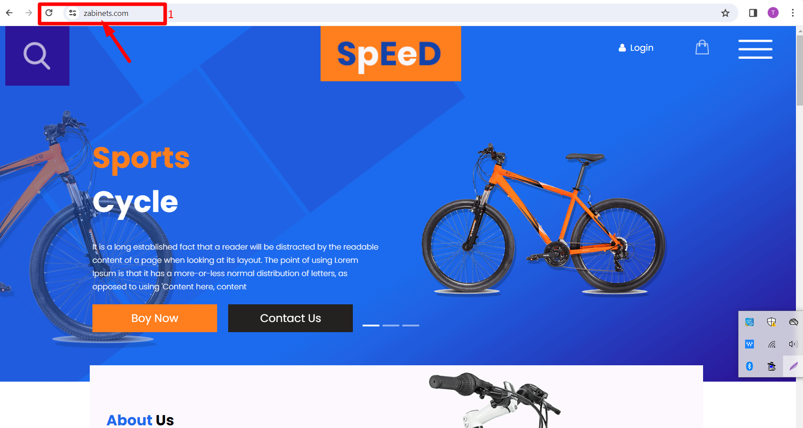

# HOW TO DEPLOY A STATIC WEBSITE IN AWS

                         

## Project Overview
This project demonstrates hosting a static HTML web app on AWS using various resources like VPC, subnets, Internet Gateway, Nat Gateway, Bastion host, Application Load Balancer, EC2 instances, Auto Scaling Group, and Route 53. The project aims to achieve high availability, fault tolerance, scalability, and elasticity for the web app.

## Architecture

VPC Configuration:

Created a VPC with public and private subnets in 2 availability zones for high availability and fault tolerance.
Used an Internet Gateway to allow communication between instances in the VPC and the internet.
Resource Placement:

Placed webserver and database servers in the private subnets to protect them.
Utilized public subnets for resources like Nat Gateway, Bastion host, and Application Load Balancer.
Internet Access:

Nat Gateway allows instances in the private App subnets and private Data subnets to access the internet.
Website Hosting:

Used EC2 instances to host the website.
Utilized an Application Load Balancer to distribute web traffic across an auto-scaling group of EC2 instances in multiple AZs.
Auto Scaling:

Used Auto Scaling Group to dynamically create EC2 instances to make the website highly available, scalable, fault-tolerant, and elastic.
Domain Name:

Utilized Route 53 to register the domain name and create a record set.
GitHub Integration:

Stored website files on GitHub.
AMI Creation:

Once the website is installed on the EC2 Instance, the EC2 instance is used to create an AMI.

## Deployment Script
#!/bin/bash

sudo su

yum update -y

yum install -y httpd 

cd  /var/www/html

wget https://github.com/taofeeklanre/static-website-Repository/raw/main/Speed%20Free%20Cycle.zip
unzip Speed\ Free\ Cycle.zip 

cp -r /var/www/html/speed/* /var/www/html

cd /var/www/html

rm -rf Speed\ Free\ Cycle.zip

systemctl enable httpd

systemctl start httpd

## Deployment Steps

## Step 1: Set up VPC
Go to the AWS Management Console and navigate to the VPC dashboard.

Click on "Create VPC" and enter the desired details (e.g., VPC name, IPv4 CIDR block).

Click on "Create".

## Step 2: Create Subnets

In the VPC dashboard, navigate to "Subnets".

Click on "Create subnet" and select the VPC created in Step 1.

Enter the subnet details (e.g., name, availability zone, IPv4 CIDR block).

Click on "Create subnet" and repeat for the second subnet in a different availability zone.

## Step 3: Create Internet Gateway (IGW)

In the VPC dashboard, navigate to "Internet Gateways".

Click on "Create internet gateway" and enter a name for the IGW.

Select the IGW and click on "Attach to VPC", then select the VPC created in Step 1.

## Step 4: Configure Route Tables

In the VPC dashboard, navigate to "Route Tables".

Select the default route table for the VPC created in Step 1 and click on "Edit routes".

Add a route with destination 0.0.0.0/0 and target as the IGW created in Step 3.

Click on "Save routes".

In the VPC dashboard, navigate to "Route Tables".

Create a new route table and associate it with the private subnets
.
Edit the new route table and add a route with destination 0.0.0.0/0 and target as the NAT Gateway's ID.

## Step 5: Launch EC2 Instance

Go to the EC2 dashboard and click on "Launch instance".

Select an Amazon Machine Image (AMI) for your EC2 instance (e.g., Amazon Linux 2).

Choose an instance type, configure instance details (e.g., VPC, subnet, auto-assign public IP), and add storage as needed.

Configure security groups to allow inbound traffic on port 80 (HTTP) and 443 (HTTPS) for your web app.

Review and launch the instance, selecting or creating a key pair for SSH access.

## Step 6: Deploy Web App to EC2 Instance

1. SSH into your EC2 instance using the EC2 Instance Connect Endpoint or key pair you downloaded.
   
2. Update the package manager:

    sudo yum update -y

3. Install Apache HTTP Server:
   
    sudo yum install -y httpd

4. Download and deploy your web app files (e.g., from GitHub):

    cd /var/www/html
   
    sudo git clone https://github.com/taofeeklanre/static-website-Repository/raw/main/Speed%20Free%20Cycle.zip

     cp -r /var/www/html/speed/* /var/www/html

    cd /var/www/html

    rm -rf Speed\ Free\ Cycle.zip

6. Start the Apache service and enable it to start on boot:

    sudo systemctl start httpd

    sudo systemctl enable httpd

## Step 7: Create a NAT Gateway

In the VPC dashboard, navigate to "NAT Gateways".

Click on "Create NAT Gateway" and select the public subnet and Elastic IP address.

Click on "Create NAT Gateway".

## Step 8: Update Route Table for Private Subnets

In the VPC dashboard, navigate to "Route Tables".

Edit the route table associated with the private subnets.

Add a route with destination 0.0.0.0/0 and target as the NAT Gateway created in Step 7.

## Step 9: Create Application Load Balancer (ALB)

In the EC2 dashboard, navigate to "Load Balancers".

Click on "Create Load Balancer" and select "Application Load Balancer".

Configure the ALB with listeners (e.g., HTTP on port 80), availability zones, and security settings.

Add the EC2 instances from Step 5 to the ALB's target group.

## Step 10: Update Security Groups

Update the security group associated with the ALB to allow inbound traffic on port 80 (HTTP) and 443 (HTTPS).

Update the security group associated with the EC2 instances to allow inbound traffic on port 80 (HTTP) from the ALB's security group.

## Step 11: Update Route 53

In the Route 53 dashboard, click on "Hosted zones" and select your domain.

Click on "Create Record Set" and configure the record set to point to the ALB's DNS name.

Save the record set.

## Step 12: Access Your Website

Wait for the DNS changes to propagate (this may take some time).

Use your domain name to access your website.

By following these additional steps, you can set up Route 53 for DNS management, a NAT Gateway for internet access from private subnets, and an Application Load Balancer for distributing traffic to your EC2 instances.

## Repository Structure
deploy.sh: Bash script for deploying the website to EC2 instances.

html.png: Reference architecture diagram for the project.

finexo.zip: Application code in zip format

others: Application code in file and folder.

html1.png: Website displayed for the application.

README.md: This README file.

## Website displayed

## Additional Resources
AWS VPC Documentation

AWS EC2 Documentation

AWS Auto Scaling Documentation

AWS Route 53 Documentation

GitHub Guides

Conclusion
This project demonstrates how to host a static website on AWS with high availability, fault tolerance, scalability, and elasticity using various AWS services and resources. The use of VPC, subnets, Internet Gateway, Nat Gateway, Bastion host, Application Load Balancer, EC2 instances, Auto Scaling Group, Route 53, and GitHub ensures a robust and reliable hosting environment for the web app.

