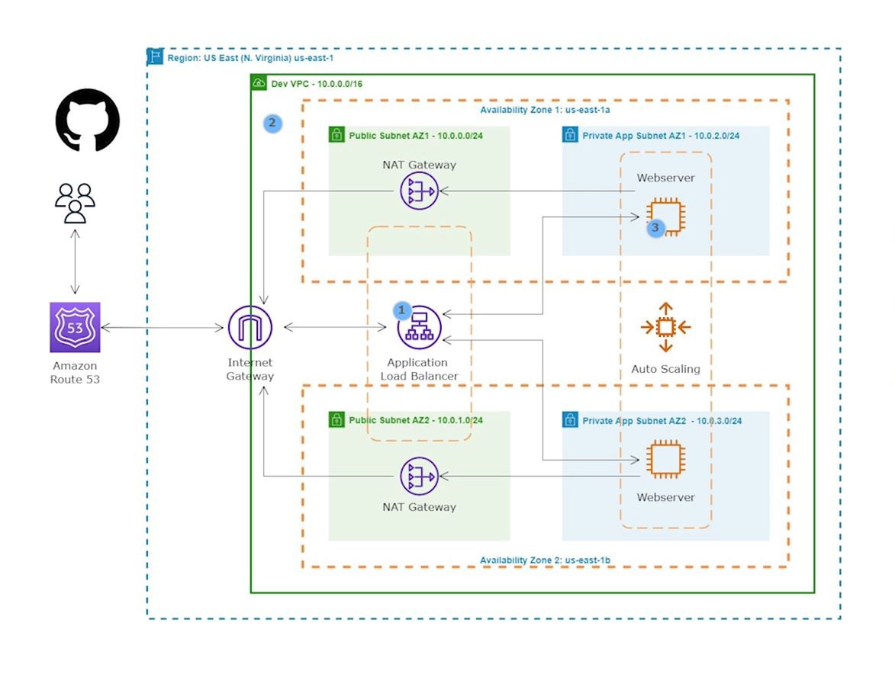

HOW TO DEPLOY A STATIC WEBSITE ON AWS

Overview
This project demonstrates hosting a static HTML web app on AWS using various resources like VPC, subnets, Internet Gateway, Nat Gateway, Bastion host, Application Load Balancer, EC2 instances, Auto Scaling Group, and Route 53. The project aims to achieve high availability, fault tolerance, scalability, and elasticity for the web app.

Architecture

VPC Configuration:

Created a VPC with public and private subnets in 2 availability zones for high availability and fault tolerance.
Used an Internet Gateway to allow communication between instances in the VPC and the internet.
Resource Placement:

Placed webserver and database servers in the private subnets to protect them.
Utilized public subnets for resources like Nat Gateway, Bastion host, and Application Load Balancer.
Internet Access:

Nat Gateway allows instances in the private App subnets and private Data subnets to access the internet.
Website Hosting:

Used EC2 instances to host the website.
Utilized an Application Load Balancer to distribute web traffic across an auto-scaling group of EC2 instances in multiple AZs.
Auto Scaling:

Used Auto Scaling Group to dynamically create EC2 instances to make the website highly available, scalable, fault-tolerant, and elastic.
Domain Name:

Utilized Route 53 to register the domain name and create a record set.
GitHub Integration:

Stored website files on GitHub.
AMI Creation:

Once the website is installed on the EC2 Instance, the EC2 instance is used to create an AMI.
Deployment Script
bash
Copy code
#!/bin/bash
sudo su
yum update -y
yum install -y httpd 
cd  /var/www/html
wget https://github.com/taofeeklanre/static-website-Repository/raw/main/Speed%20Free%20Cycle.zip
unzip Speed\ Free\ Cycle.zip 
cp -r /var/www/html/speed/* /var/www/html
cd /var/www/html
rm -rf Speed\ Free\ Cycle.zip
systemctl enable httpd
systemctl start httpd
Conclusion
This project demonstrates how to host a static website on AWS with high availability, fault tolerance, scalability, and elasticity using various AWS services and resources. The use of VPC, subnets, Internet Gateway, Nat Gateway, Bastion host, Application Load Balancer, EC2 instances, Auto Scaling Group, Route 53, and GitHub ensures a robust and reliable hosting environment for the web app.

Feel free to adjust the README file as needed for your project documentation.
